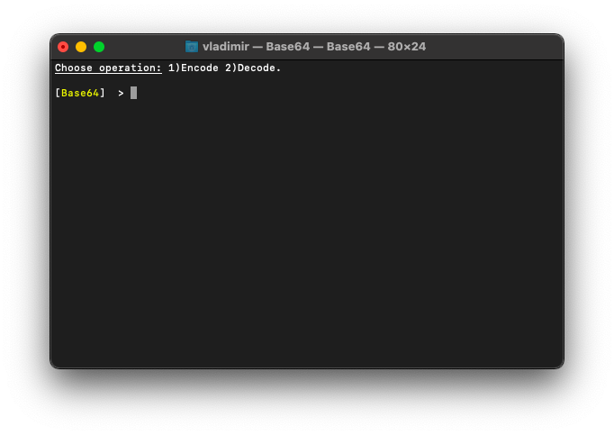
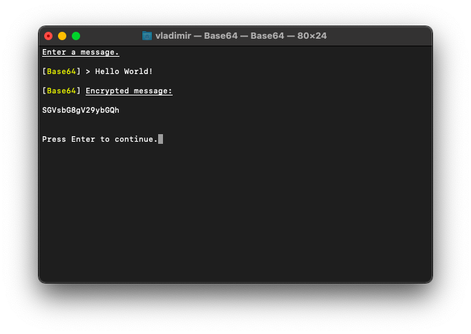
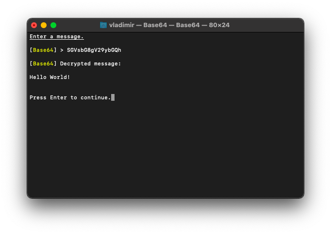

# 🔑 Base64 



## What is it?

_Base64_ is a simple character converter. It converts characters into nums, might be used in encryption protocols or as independent algorithm. It is a part of [_RedLibrary_](https://github.com/Red-company/RedLibrary).

## How to use?

Function prototypes:

```C
// Encryption.
inline std::string * Base64Encode(std::string *data);

// Decryption.
inline std::string * Base64Decode(std::string *data);
```

## Example:





##
All material in this repository is in the public domain.
